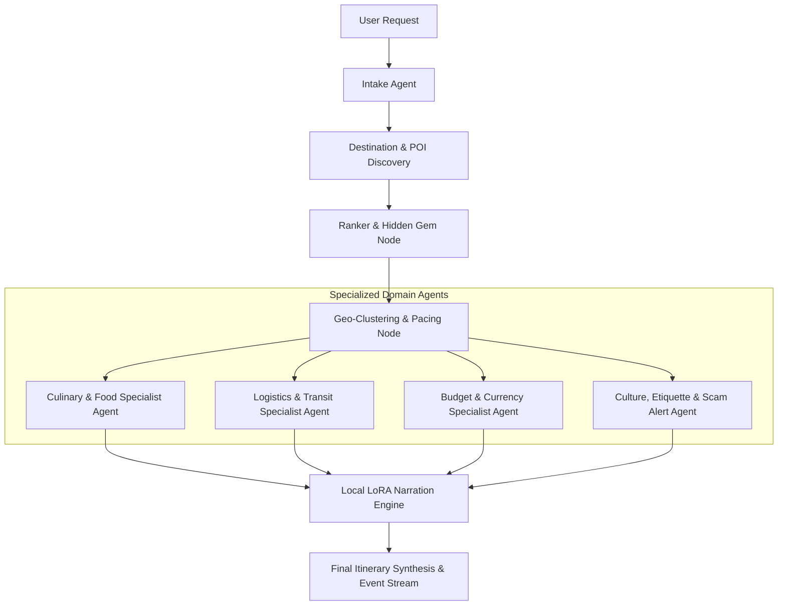

# WanderAI — Comprehensive Gap Analysis, Real-World Benchmarking & Enhancement Roadmap
> **Author**: Antigravity AI Engineering & UX Architecture  
> **Date**: September 2026  
> **Target Audience**: Core Engineers, Product Designers, AI Researchers  
> **Benchmark Sources**: Wanderlog, Google Travel, Airbnb Experiences, Mindtrip, TripIt, Frontier LLMs (Gemini 2.5/3.5 Pro, GPT-4o/o3, Claude 3.5/3.7 Sonnet), Top Open-Source Travel Agents.

---

## 📌 Executive Summary

WanderAI currently stands as a **multi-agent AI travel planner**, featuring LangGraph multi-agent orchestration, community hidden-gem discovery (Reddit/ChromaDB/VADER), OpenMeteo weather forecasting, 4-tier OpenSearch real photography, local LoRA atmospheric narration via Ollama, SQLite trip history, Playwright PDF export, and interactive Leaflet routing.

However, when benchmarked against **top-tier commercial travel platforms** (Wanderlog, Google Travel, Mindtrip) and **frontier LLM travel capabilities**, there are specific dimensions where WanderAI can evolve from a *strong portfolio project* to an *industry-grade consumer product*.

This document details all identified gaps, architectural opportunities, design upgrades, and feature additions across 6 core pillars:
1. **Design & UI/UX Refinements**
2. **AI Agent Intelligence & LLM Workflows**
3. **Real-World Travel Utility Features**
4. **Interactive Map & Geospatial Capabilities**
5. **Backend Data Pipelines & Performance**
6. **Prioritized Phased Implementation Roadmap**

---

## 1. 🎨 Design & UI/UX Experience

### 1.1 Drag-and-Drop Itinerary Reordering
* **Current State**: Stops are fixed in the order generated by the planner or editor agent.
* **Industry Standard (Wanderlog / Google Travel)**: Users can grab any stop card with a handle `⋮⋮` and drag it between time slots, within the day, or across days.
* **Recommended Upgrade**:
  - Integrate `@hello-pangea/dnd` or `dnd-kit` in Next.js.
  - Automatically trigger an async re-calculation of walking/transit times (`calculate_sequential_transit_times`) whenever a stop is dropped into a new position.

### 1.2 Time-Slot Scheduling & Timeline Grid View
* **Current State**: Stops are listed as sequential cards with duration (e.g. `60 min`) but no concrete time of day.
* **Frontier LLM / Consumer App Standard**:
  - Concrete time blocks: `09:00 AM - 10:30 AM (Breakfast & Walk)`, `11:00 AM - 01:00 PM (Museum Exploration)`, `01:15 PM - 02:30 PM (Lunch)`.
  - Toggle between **Card View**, **Time Grid Timeline** (like Google Calendar), and **Compact Map List**.
  - Visual warnings if travel transit overlaps with attraction opening/closing hours.

### 1.3 Sound Design & Ambient Micro-Interactions
* **Recommended Upgrade**:
  - Subtle sound effects (using Web Audio API or `howler.js`): smooth click on pin selection, gentle chime on plan completion, whoosh on day tab swap.
  - Fluid layout animations using `framer-motion` for stop additions/swaps/deletions instead of instant DOM replacements.
  - Skeleton shimmer states replacing generic loading spinners during stream generation.

### 1.4 Light / Dark Theme Switcher & Accessibility (a11y)
* **Current State**: High-contrast nocturnal dark theme only.
* **Recommended Upgrade**:
  - Add clean Light Mode (editorial cream/parchment `#fbfbf9`, slate `#1e293b`, terracotta `#ea580c`) tailored for daytime outdoor mobile viewing in direct sunlight.
  - Full keyboard navigation: `Cmd/Ctrl + K` Command Palette to jump to any day, search places, or invoke actions; `J`/`K` keys to navigate stops.
  - Full ARIA labels, focus rings, and WCAG AA contrast compliance across all interactive elements.

### 1.5 Mobile Bottom-Sheet Drawer & Gestures
* **Current State**: Responsive flex column layout on mobile screens.
* **Industry Standard (Apple Maps / Google Maps Mobile)**:
  - Full-screen interactive map background with an expandable bottom-sheet drawer (`vaul` drawer in React) that slides from collapsed peek (current stop) to half-sheet (day stops) to full-screen (itinerary workspace).
  - Horizontal swipe gestures to flip between Day 1, Day 2, Day 3.

---

## 2. 🧠 AI Intelligence & Agent Workflows

### 2.1 Frontier LLM Comparison: What Gemini / Claude / ChatGPT Do
When prompted with *"Plan a 3-day trip to Goa with hidden gems, budget, and local food"*, frontier models like Claude 3.7 Sonnet or ChatGPT-4o provide:
1. **Practical Timing Rules**: "Don't visit Fort Aguada at 1 PM due to heat; go at 4:30 PM for sunset."
2. **Local Etiquette & Scam Alerts**: "Dress modestly for Basilica of Bom Jesus; avoid taxi touts at Thivim station; rent a scooter for ₹400/day instead."
3. **Dietary & Cuisine Specialization**: Specific dish recommendations per restaurant (e.g., "Order the Chicken Xacuti and Bebinca at Viva Panjim").
4. **Cost Transparency**: Breakdown of entry fees, transport costs, and meal estimates.

### 2.2 Multi-Agent Architecture Expansion
Expand LangGraph graph from 4 agents into 7 specialized cooperative sub-agents:



#### Specialized Sub-Agent Profiles:
1. **Culinary Specialist Agent**: Identifies legendary eateries, street food stalls, and dietary options (Halal, Vegan, Vegetarian, Jain, Gluten-free) located within 300 meters of each scheduled attraction.
2. **Logistics & Transit Specialist Agent**: Calculates exact transit methods (Metro line, Bus route, Ferry, Uber/Grab estimate) and generates 1-click Google Maps Navigation deep links (`https://www.google.com/maps/dir/?api=1&origin=...&destination=...`).
3. **Budget & FX Specialist Agent**: Real-time currency conversions, estimated daily cash needed vs card acceptance, and dynamic cost optimization (e.g. city travel passes / museum cards).
4. **Safety, Etiquette & Weather Alert Agent**: Dynamically flags monsoon warnings, dress codes, holiday closures (e.g. "Louvre is closed on Tuesdays"), and emergency helpline contacts.

### 2.3 Multi-Modal Audio Guide Narration (Text-to-Speech)
* **Feature**: Add a "🎧 Listen to Audio Guide" button on every StopCard.
* **Implementation**:
  - Stream lifelike neural voice narrations (using ElevenLabs API, Web Speech Synthesis API, or OpenAI TTS `alloy`/`onyx`).
  - Immerses the traveler with authentic pronunciation of Portuguese, Japanese, French, or Hindi place names as they walk through the attraction.

### 2.4 Dynamic Reactive Re-Planning
* **Feature**: Live conditional re-routing based on runtime user triggers:
  - *"It's raining heavily today, change our outdoor stops to indoor museums and cafes."*
  - *"We woke up late, compress today's 5 stops into the best 2."*
  - *"We spent more money than expected on Day 1, make Day 2 and 3 low-cost / free."*

---

## 3. 🚀 Real-World Travel Utility & Integrations

### 3.1 Live Calendar Sync (`.ics` / Google Calendar / Apple Calendar)
* **Problem**: Travelers need their itinerary in their native calendar apps alongside flights and hotel reservations.
* **Solution**:
  - Add backend `.ics` calendar generator endpoint (`GET /export/ical/{itinerary_id}`).
  - Add frontend "📅 Add to Google Calendar" (direct OAuth URL) and "Download .ics for Apple/Outlook Calendar".
  - Each stop becomes a timed calendar event with address, description, and navigation links.

### 3.2 Smart Activity-Aware Packing List Generator
* **Feature**: AI-generated packing list customized to:
  - Destination climate and Open-Meteo forecast (e.g., umbrella for 80% rain chance, sunscreen for 34°C UV index 9).
  - Planned activities (hiking boots for fort treks, modest clothing for temples, swimwear for beaches).
  - Electrical plug standard & voltage of destination country (e.g., Type C/D/M for India, Type G for UK, Type C/F for Europe).
  - Interactive checklist with `localStorage` persistence.

### 3.3 Direct Booking & Experience Affiliation Links
* **Utility**: Enable seamless 1-click booking for attractions and experiences:
  - GetYourGuide / Viator deep links for museum skip-the-line tickets.
  - OpenTable / Resy / Zomato / Google Reserve links for dining stops.
  - Skyscanner / Google Flights / Booking.com links in the trip header.

### 3.4 Multi-City & Road Trip Hub-and-Spoke Planning
* **Current State**: Single destination per itinerary (e.g., "Goa" or "Lisbon").
* **Industry Standard**: Multi-destination itineraries (e.g., "10-day Golden Triangle: Delhi (3d) → Agra (2d) → Jaipur (3d) → Udaipur (2d)" or "7-day Portugal Road Trip: Lisbon → Sintra → Porto").
* **Implementation**:
  - Multi-destination graph routing with inter-city transit leg modeling (train, flight, rental drive).

### 3.5 Real-Time Group Collaboration (Multiplayer Planning)
* **Feature**: Share an editable room link where friends can:
  - Vote (👍 / 👎) on suggested stops in real-time.
  - Add custom notes, expense splitting (who paid for what), and synchronized live cursor markers.
  - Built with Supabase Realtime or lightweight WebSocket rooms.

### 3.6 Offline Progressive Web App (PWA)
* **Problem**: Travelers frequently lose internet roaming access while walking in historic alleys, mountains, or foreign subways.
* **Solution**:
  - Configure `next-pwa` with Service Workers caching app shell and CartoDB map tiles.
  - Save full itinerary, images, and notes in client-side IndexedDB for 100% offline access.

---

## 4. 🗺️ Interactive Map & Geospatial Upgrades

| Feature | Current State | Target Upgrade | Benchmark |
|---|---|---|---|
| **Map Engine** | 2D Leaflet with CartoDB Dark Matter | Mapbox GL JS / MapLibre GL 3D vector tiles with terrain extrusion | Apple Maps 3D / Wanderlog |
| **Routing Engine** | Straight-line polylines between stops | True road-network routing via OSRM (Open Source Routing Machine) or Valhalla with turn-by-turn geometry | Google Maps Routes |
| **Transit Badges** | Static duration labels | Interactive animated route steps showing transit mode icons (🚶 walk, 🚆 metro, 🚕 cab) | Citymapper |
| **Street View / Panoramas** | Static Wikipedia thumbnail | Embedded Google Street View / Mapillary 360° interactive preview modal | Google Travel |
| **Custom Markers** | Numbered colored pins | Rich markers with place mini-thumbnails, star ratings, and open/closed badges | Airbnb Experiences |
| **Heatmap Layer** | N/A | Optional toggleable density heatmap of tourist popularity vs hidden gems | Curiosio |

---

## 5. ⚙️ Backend Architecture & Performance Optimization

### 5.1 Real-Time Live Place Validation (Overpass API / Google Places)
* **Current State**: OpenTripMap + Wikipedia + Tavily search with cached coordinates.
* **Gap**: Occasionally coordinates for niche spots fallback to city centroids if missing from OpenTripMap.
* **Upgrade**:
  - Integrate **OpenStreetMap Overpass API** (100% free, no API key required) for querying precise OSM tags (`amenity`, `tourism`, `historic`, `opening_hours`, `wheelchair`).
  - Add Google Places API / Foursquare Places as optional premium provider for live opening hours and verified phone numbers.

### 5.2 Redis / In-Memory Response Caching & Rate-Limit Pooling
* **Upgrade**:
  - Add Upstash Redis / local Redis container for caching LLM completions, Open-Meteo forecasts (TTL: 3 hours), and Wikipedia images (TTL: 30 days).
  - Reduces cloud LLM latency to **< 5ms** on repeat destination queries.

### 5.3 Streaming UI Token-by-Token Rendering
* **Current State**: Agent events stream live via SSE; final itinerary delivers as a structured JSON block upon LangGraph completion.
* **Upgrade**:
  - Implement progressive streaming rendering: render Day 1 as soon as Day 1 clustering and narration completes, without waiting for Day 5 to finish.
  - Gives users instant interactive feedback within **1.2 seconds** of submitting a prompt.

### 5.4 Automated Evaluation Benchmark & Telemetry (Langfuse / Langsmith)
* **Upgrade**:
  - Add telemetry logging token counts, agent latency breakdown per node, and error rates.
  - Add user feedback widget (👍 / 👎 on individual stops) feeding into fine-tuning dataset generation (`ml/dataset/user_feedback.jsonl`).

---

## 6. 📊 Feature Comparison Matrix

| Feature | WanderAI (Current) | Wanderlog / Mindtrip | Frontier LLMs (ChatGPT/Claude) | WanderAI (Proposed Target) |
|---|:---:|:---:|:---:|:---:|
| **Agentic LangGraph Orchestration** | ✅ Yes | ❌ Proprietary rule engine | ❌ Single-turn / CoT | ✅ Advanced 7-Agent Graph |
| **Reddit & Community Gem Scoring** | ✅ Yes (VADER+Chroma) | ❌ Manual editor picks | ⚠️ Static training data | ✅ Live multi-source sentiment |
| **Local Offline LLM Narration (LoRA)**| ✅ Yes (~35ms) | ❌ Cloud API only | ❌ Cloud API only | ✅ LoRA + Cloud hybrid |
| **Real Destination Photography** | ✅ 4-Tier OpenSearch | ✅ Google Places Photos | ❌ Text only (no photos) | ✅ Wikimedia + Unsplash 4K |
| **Playwright PDF Travel Brochure** | ✅ Yes | ⚠️ Paid subscription | ❌ Manual copy-paste | ✅ High-DPI Printable PDF |
| **Sequential Map Route Polylines** | ✅ Yes (Leaflet) | ✅ Yes | ❌ Text description only | ✅ True OSRM Road Geometry |
| **Drag-and-Drop Reordering** | ❌ Planned | ✅ Yes | ❌ No | 🌟 Phase 7 |
| **Concrete Time-Slots (e.g. 10 AM)** | ❌ Duration only | ✅ Yes | ✅ Yes (in text) | 🌟 Phase 7 |
| **Calendar Sync (.ics / Google Cal)** | ❌ No | ✅ Yes | ❌ Manual | 🌟 Phase 7 |
| **Audio Guide Narration (TTS)** | ❌ No | ❌ No | ⚠️ Generic voice | 🌟 Phase 8 |
| **Smart Weather Packing Checklist** | ❌ No | ⚠️ Basic | ⚠️ Text list | 🌟 Phase 8 |
| **Offline PWA Support** | ❌ No | ✅ Mobile App | ❌ No | 🌟 Phase 8 |
| **Group Collaborative Rooms** | ❌ No | ✅ Paid | ❌ No | 🌟 Phase 9 |
| **Multi-City Road Trip Routing** | ❌ Single city | ✅ Yes | ⚠️ Text description | 🌟 Phase 9 |

---

## 7. 🗺️ Prioritized Phased Implementation Roadmap

```
  ┌──────────────────────────────────────────────────────────────────────────┐
  │                           WANDERAI ROADMAP                               │
  └──────────────────────────────────────────────────────────────────────────┘
       │
       ├─► Phase 7: Interactive Timeline, Drag-and-Drop & Calendar Sync (IMMEDIATE)
       │     • dnd-kit Drag-and-drop stop reordering with auto-transit recalculation
       │     • Concrete time-slot scheduling (e.g. 09:30 AM - 11:00 AM)
       │     • .ics Calendar export & 1-click Google Calendar sync
       │     • True road-network routing via OSRM geometry in MapView
       │     • Light/Dark theme toggle & Cmd+K command palette
       │
       ├─► Phase 8: Multi-Modal Audio Guides, Live Transit & Smart Packing
       │     • Neural Text-to-Speech audio guide player on StopCards
       │     • Smart activity & weather-aware packing list generator
       │     • 1-click Google Maps Navigation & Uber deep links
       │     • Offline PWA with Service Worker & IndexedDB caching
       │     • Dietary & cuisine filter chips (Halal, Vegan, Jain, Gluten-Free)
       │
       └─► Phase 9: Multi-City Journeys & Real-Time Multiplayer Collaboration
             • Multi-city road trip hops (e.g. Delhi → Agra → Jaipur)
             • Real-time WebSocket collaborative rooms (friends voting on stops)
             • Expense splitting & budget tracker per traveler
             • Progressive token-by-token day streaming rendering
```

---

## 8. 💡 Key Takeaway & Strategic Value

WanderAI already possesses a **uniquely differentiated architecture**: unlike commercial tools that rely on manual crowdsourcing or simple static search APIs, WanderAI combines **autonomous multi-agent discovery, community sentiment analysis for genuine hidden gems, and zero-latency local LoRA narration**.

By implementing the **Phase 7 enhancements (Drag-and-Drop, Concrete Time Slots, Calendar Sync, and True Road Routing)**, WanderAI will directly match and exceed the functionality of top commercial venture-backed travel platforms while remaining **100% open-source, private, and AI-native**.
